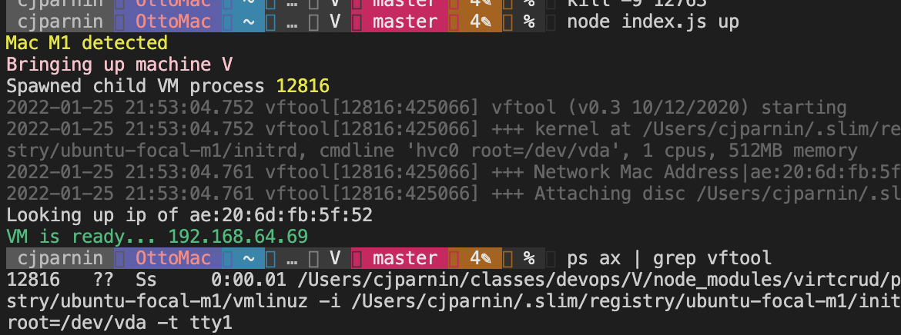

# V

This homework will involve learning and practicing concepts related to virtualization.

**The assignment is due Wednesday, Feb 2nd, before midnight**.

## Virtual Machine provisioning with CLI program (50)

You will start with a starter code base and modify it to fulfill the homework criteria.
Please do the following before you start the homework.
 
### Clone and set-url

1. Clone the following template repository. Then, modify the git remote url so that it now will point to your HW1-<unity> repo.

```bash
git clone http://github.com/CSC-DevOps/V
cd V
git remote -v
git remote set-url origin https://github.ncsu.edu/CSC-DevOps-S22/HW1-<unity>-DevOps
```

### Install and test

2. Install the npm packages, then create a symlink for running your program.
```bash
npm install
npm link
```

Try it out.

```bash
# Windows/Virtual Box (Cmd.exe)
v up %USERPROFILE/.bakerx/.persist/images/focal
# Mac/Linux/Virtual Box
v up ~/.bakerx/.persist/images/focal
```

```bash
# M1
wget https://github.com/CSC-DevOps/VM/releases/download/v1.0.0/ubuntu-focal-m1.tar.gz
tar -zxvf ubuntu-focal-m1.tar.gz
v up ubuntu-focal-m1/
```

You will see a virtual machine being prepared and booted; however, **the program is incomplete and will not fully work**.

## Choose your path 👣 | 👣

Based on your local development environment, you will need to use a different virtualization platform. For most cases, you will be able to take advantage of the venerable _VirtualBox_, but for others, you might have to travel on a _different road_.

---

## :star: VirtualBox base requirements 👣

---

If you do not have the ubuntu focal image for `bakerx`, pull it.

```
bakerx pull focal cloud-images.ubuntu.com 
```

1) Add the following required components to your project by editing the `customize(name)` function inside lib/provider/vbox.js. You will want to take advantage of the `VBoxManage.execute` wrapper to execute VirtualBox commands.

* Add a NIC with NAT networking.
* Add a port forward from 2800 => 22 for guestssh.
* Add a port forward from 9000 => 5001 for a node application.

2) Add the following required components to your project by editing the `postconfiguration(name)` function inside the lib/provider/vbox.js. You will want to take advantage of the `sshExe` command wrapper to send commands to the VM.

* Install nodejs and git
* Clone https://github.com/CSC-DevOps/App
* Install the npm packages for App

3) Add a new command by creating a ssh.js inside the commands directory. 
When running `v ssh` it should provide an interactive ssh session into your VM.

* Implement and demonstrate running `v ssh`.
* Manually run `node main.js start 5001`.
* Demonstrate you can visit `localhost:9000` to see your running App.

---

## :star: Virtualization Framework base requirements 👣

---

Download [ubuntu focal image for M1](https://github.com/CSC-DevOps/VM/releases/download/v1.0.0/ubuntu-focal-m1.tar.gz) for testing.

Update the code to make the follow adjustments:

1) Fix kernel cmd_line to include location of root filesystem `root=/dev/vda`.

When you've gotten this to work, see if you can correctly run program and ensure you can ssh into the instance:

```
ssh -i keys/slim_rsa ubuntu@<IP>
```

**Note:** You will have to stop the old instance of the VM (`kill -9 <PID>`), before re-running program.



2) Fix dns.

Currently, the VM does not have a proper nameserver configured, meaning while you can access external networks, you can't resolve domain names. 

  ```bash
  ubuntu@localhost:~$ ping 8.8.8.8
  PING 8.8.8.8 (8.8.8.8): 56 data bytes
  64 bytes from 8.8.8.8: icmp_seq=0 ttl=114 time=27.117 ms
  ubuntu@localhost:~$ host google.com
  ;; connection timed out; no servers could be reached
  ```

Write code to update the /etc/resolv.conf file:

  ```
  nameserver 8.8.8.8
  nameserver 8.8.4.4
  ```

3) Add the following required components to your project by editing the `postcustomize()` function inside lib/provider/vf.js. You will want to take advantage of the `sshExe` command wrapper to send commands to the VM.

* Install nodejs and git
* Clone https://github.com/CSC-DevOps/App
* Install the npm packages for App

4) Add a new command by creating a ssh.js inside the commands directory. 
When running `v ssh` it should provide an interactive ssh session into your VM.

* Implement and demonstrate running `v ssh`.
* Manually run `node main.js start 9000`.
* Demonstrate you can visit `<IP>:9000` to see your running App.

## Class activities (20)

Complete [NodeJS Essentials: Promises](https://devops.docable.cloud/chrisparnin/v/61a91ec418321edaed0f8ea6).

## Conceptual Questions (20)

* Why can code be difficult to run on another machine? 
* Explain the concepts of a computing environment.
* Compare full emulation virtualization vs. binary translation
* What are some use cases associated with microvms and unikernels?
* In VM workshop, why can't the Virtual Box ip address be pinged from the host (or accessible from the web browser)?
* Compare bridged networking with host-only networking
* How does exactly does bakerx access the virtual machine through ssh?
* Explain the difference between the `rootfs` disk image and `initrd` disk image.
* What was a new feature, challenge, or interesting learning experience that you encountered while doing the homework or classroom exercises?

## Screencast (10)

Create a screencast of your assignment:

* Demonstrate running your code to provision the VM (`v up`), running your customization and post-configuration steps, and ssh (`v ssh`) and a starting your App. Demonstrate your app running on your browser. Demonstrate any extra requirements fulfilled.

## Evaluation

You will be graded for completing the following tasks:

* [ ] CLI program (50).
* [ ] Complete class activities (20).
* [ ] Answer conceptual questions (20).
* [ ] Screencast (10).
* [ ] :mountain_cableway: Bonus: Integrate another `virtcrud`-based provider that you did not already implement into your V application (hyper-v, kvm, vf) (+30). :warning: Only attempt this if you're very comfortable with digging into the internals of nodejs/virtualization concepts, limited teaching staff help will be provided.

## Submission

Submit your homework materials, checked into your repository by the deadline.

In your repository, check in all relevant code, and provide answers, link to relevant files, and link to your screencast the repository's README.md.

The assignment is due Wednesday, Feb 2nd, before midnight.
